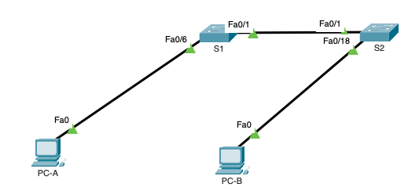
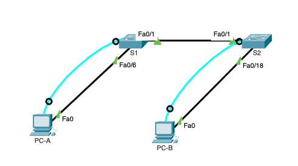

# Лабораторная работа. Просмотр таблицы MAC-адресов коммутатора 

### Цели

- Часть 1. Создание и настройка сети.  
- Часть 2. Изучение таблицы МАС-адресов коммутатора. 


### Часть 1. Создание и настройка сети

#### Шаг 1. Подключите сеть в соответствии с топологией.



#### Шаг 2. Настройте узлы ПК.

Настроем узел ПК PC-A:

```
C:\>ipconfig /all

FastEthernet0 Connection:(default port)

   Connection-specific DNS Suffix..: 
   Physical Address................: 0005.5EA3.E5C2
   Link-local IPv6 Address.........: FE80::205:5EFF:FEA3:E5C2
   IPv6 Address....................: ::
   IPv4 Address....................: 192.168.1.1
   Subnet Mask.....................: 255.255.255.0
   Default Gateway.................: ::
                                     0.0.0.0
```

Настройка сети узла ПК PC-B:

```
C:\>ipconfig /all

FastEthernet0 Connection:(default port)

   Connection-specific DNS Suffix..: 
   Physical Address................: 0001.C7C8.7168
   Link-local IPv6 Address.........: FE80::201:C7FF:FEC8:7168
   IPv6 Address....................: ::
   IPv4 Address....................: 192.168.1.2
   Subnet Mask.....................: 255.255.255.0
   Default Gateway.................: ::
                                     0.0.0.0
```

#### Шаг 3. Выполните инициализацию и перезагрузку коммутаторов.

Подключим консольный кабель к ПК PC-A и коммутатору S1, и к ПК PC-B и коммутатору S2



Подключимся по терминалу к коммутатору S1 и выполним его инициализацию 

```
Switch#erase startup-config 
Erasing the nvram filesystem will remove all configuration files! Continue? [confirm]
[OK]
Erase of nvram: complete
%SYS-7-NV_BLOCK_INIT: Initialized the geometry of nvram
```

Перезагрузим коммутатор S1

```
Switch#reload
Proceed with reload? [confirm]
C2960 Boot Loader (C2960-HBOOT-M) Version 12.2(25r)FX, RELEASE SOFTWARE (fc4)
Cisco WS-C2960-24TT (RC32300) processor (revision C0) with 21039K bytes of memory.
2960-24TT starting...
Base ethernet MAC Address: 0030.F29D.0206
Xmodem file system is available.
Initializing Flash...
```
Проделаем аналогичные манипуляции с коммутатором S2

#### Шаг 4. Настройте базовые параметры каждого коммутатора.

Выполним настройку коммутатора S1

##### a.	Настройте имена устройств в соответствии с топологией.

`Switch(config)#hostname S1`

##### b.	Настройте IP-адреса, как указано в таблице адресации.

```
S1(config)#interface vlan 1
S1(config-if)#ip address 192.168.1.11 255.255.255.0
S1(config-if)#no shutdown 
```

##### c.	Назначьте cisco в качестве паролей консоли и VTY.

Настройка консоли

```
S1(config)#service password-encryption 
S1(config)#line console 0
S1(config-line)#logging synchronous 
S1(config-line)#password cisco
S1(config-line)#login
```
Настройка виртуальную консоль VTY

```
S1(config)#line vty 0 4
S1(config-line)#password cisco
S1(config-line)#login
S1(config-line)#logging synchronous 
S1(config-line)#transport input telnet 
S1(config-line)#login

```

##### d.	Назначьте class в качестве пароля доступа к привилегированному режиму EXEC.

`S1(config)#enable password class`

 [Файл конфигурации коммутатора S1](configs/S1)

 Аналогичные действия проделываем на коммутаторе S2.  
 [Файл конфигурации коммутатора S2](configs/S2)
 
 
###  Часть 2. Изучение таблицы МАС-адресов коммутатора
 
####  Шаг 1. Запишите МАС-адреса сетевых устройств.
 
##### a.	Откройте командную строку на PC-A и PC-B и введите команду ipconfig /all.

Назовите физические адреса адаптера Ethernet.

MAC-адрес компьютера PC-A: 0005.5EA3.E5C2   
MAC-адрес компьютера PC-B: 0001.C7C8.7168

##### b.	Подключитесь к коммутаторам S1 и S2 через консоль и введите команду show interface F0/1 на каждом коммутаторе.

Назовите адреса оборудования во второй строке выходных данных команды (или зашитый адрес — bia).

```
S1>show interfaces f0/1
FastEthernet0/1 is up, line protocol is up (connected)
  Hardware is Lance, address is 00d0.d3d5.4c01 (bia 00d0.d3d5.4c01)
 BW 100000 Kbit, DLY 1000 usec,
...
```

МАС-адрес коммутатора S1 Fast Ethernet 0/1: 00d0.d3d5.4c01

```
S2>show interfaces f0/1
FastEthernet0/1 is up, line protocol is up (connected)
  Hardware is Lance, address is 0001.6399.8101 (bia 0001.6399.8101)
 BW 100000 Kbit, DLY 1000 usec,
...
```

МАС-адрес коммутатора S2 Fast Ethernet 0/1: 0001.6399.8101

#### Шаг 2. Просмотрите таблицу МАС-адресов коммутатора.

##### a.	Подключитесь к коммутатору S2 через консоль и войдите в привилегированный режим EXEC.

```
S2#show users 
    Line       User       Host(s)              Idle       Location
*  0 con 0                idle                 00:00:00 
```

##### b.	В привилегированном режиме EXEC введите команду show mac address-table и нажмите клавишу ввода

```
S2#show mac-address-table 
          Mac Address Table
-------------------------------------------

Vlan    Mac Address       Type        Ports
----    -----------       --------    -----

   1    0001.c7c8.7168    DYNAMIC     Fa0/18
   1    00d0.d3d5.4c01    DYNAMIC     Fa0/1
```

Записаны ли в таблице МАС-адресов какие-либо МАС-адреса? - Записаны.  

Какие МАС-адреса записаны в таблице? - 0001.c7c8.7168 и 00d0.d3d5.4c01

С какими портами коммутатора они сопоставлены и каким устройствам принадлежат? - 0001.c7c8.7168 - сопоставлен с портом Fa0/18 и принадлежит компьютеру PC-B; 00d0.d3d5.4c01 - сопоставлен с портом Fa0/1 и принадлежит коммутатору S1

Как можно определить, есл не записаны МАС-адреса сетевых устройств в шаге 1, каким устройствам принадлежат МАС-адреса, используя только выходные данные команды show mac address-table? - show arp

```
S2#show arp
Protocol  Address          Age (min)  Hardware Addr   Type   Interface
Internet  192.168.1.1             22  0005.5EA3.E5C2  ARPA   Vlan1
Internet  192.168.1.2             9   0001.C7C8.7168  ARPA   Vlan1
Internet  192.168.1.12            -   00D0.5866.D5B6  ARPA   Vlan1
```

Работает ли это решение в любой ситуации? - Может быть есть ситуации, в которых arp-таблица не работает, но о них не знаю (

#### Шаг 3. Очистите таблицу МАС-адресов коммутатора S2 и снова отобразите таблицу МАС-адресов.

##### a.	В привилегированном режиме EXEC введите команду clear mac address-table dynamic 

##### b.	Снова быстро введите команду show mac address-table.

```
S2#show mac-address-table 
          Mac Address Table
-------------------------------------------

Vlan    Mac Address       Type        Ports
----    -----------       --------    -----

   1    00d0.d3d5.4c01    DYNAMIC     Fa0/1
```

Указаны ли в таблице МАС-адресов адреса для VLAN 1? - Указаны

Указаны ли другие МАС-адреса? - Не указаны

Через 10 секунд введите команду show mac address-table и нажмите клавишу ввода. Появились ли в таблице МАС-адресов новые адреса? - Не появились


#### Шаг 4. С компьютера PC-B отправьте эхо-запросы устройствам в сети и просмотрите таблицу МАС-адресов коммутатора.

##### a.	На компьютере PC-B откройте командную строку и еще раз введите команду arp -a.

```
C:\>arp -a
  Internet Address      Physical Address      Type
  192.168.1.1           0005.5ea3.e5c2        dynamic
  192.168.1.12          00d0.5866.d5b6        dynamic
```

Не считая адресов многоадресной и широковещательной рассылки, сколько пар IP- и МАС-адресов устройств было получено через протокол ARP? - две пары

##### b.	Из командной строки PC-B отправьте эхо-запросы на компьютер PC-A, а также коммутаторы S1 и S2.

Ping до PC-A:

```
C:\>ping 192.168.1.1

Pinging 192.168.1.1 with 32 bytes of data:

Reply from 192.168.1.1: bytes=32 time<1ms TTL=128
Reply from 192.168.1.1: bytes=32 time<1ms TTL=128
Reply from 192.168.1.1: bytes=32 time=11ms TTL=128
Reply from 192.168.1.1: bytes=32 time<1ms TTL=128
```

Ping до S1:

```
C:\>ping 192.168.1.11

Pinging 192.168.1.11 with 32 bytes of data:

Request timed out.
Reply from 192.168.1.11: bytes=32 time<1ms TTL=255
Reply from 192.168.1.11: bytes=32 time<1ms TTL=255
Reply from 192.168.1.11: bytes=32 time<1ms TTL=255
```

Ping до S2:

```
C:\>ping 192.168.1.11

Pinging 192.168.1.11 with 32 bytes of data:

Request timed out.
Reply from 192.168.1.11: bytes=32 time<1ms TTL=255
Reply from 192.168.1.11: bytes=32 time<1ms TTL=255
Reply from 192.168.1.11: bytes=32 time<1ms TTL=255
```

От всех ли устройств получены ответы? - ответ получен от всех устройств

##### c.	Подключившись через консоль к коммутатору S2, введите команду show mac address-table.

```
S2#show mac-address-table 
          Mac Address Table
-------------------------------------------

Vlan    Mac Address       Type        Ports
----    -----------       --------    -----

   1    0001.64a8.7941    DYNAMIC     Fa0/1
   1    0001.c7c8.7168    DYNAMIC     Fa0/18
   1    0005.5ea3.e5c2    DYNAMIC     Fa0/1
   1    00d0.d3d5.4c01    DYNAMIC     Fa0/1
```

Добавил ли коммутатор в таблицу МАС-адресов дополнительные МАС-адреса?

```
0001.64a8.7941 - Vlan 1
0001.c7c8.7168 - PC-B   
0005.5ea3.e5c2 - PC-A   
00d0.d3d5.4c01 - S1
```


На компьютере PC-B откройте командную строку и еще раз введите команду arp -a.
Появились ли в ARP-кэше компьютера PC-B дополнительные записи для всех сетевых устройств, которым были отправлены эхо-запросы?

```
C:\>arp -a
  Internet Address      Physical Address      Type
  192.168.1.1           0005.5ea3.e5c2        dynamic
  192.168.1.11          0001.64a8.7941        dynamic
  192.168.1.12          00d0.5866.d5b6        dynamic
```
