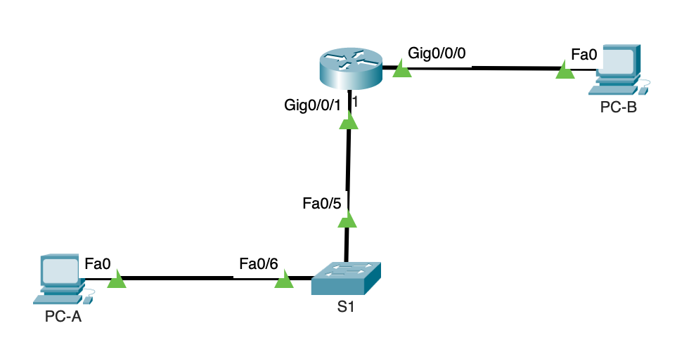

Лабораторная работа. Настройка IPv6-адресов на сетевых устройствах

Топология


Таблица адресации

| **Устройство** | **Интерфейс** | **IPv6-адрес**      | **Link local IPv6-адрес** | **Длина префикса** | **Шлюз по умолчанию** |
|----------------|---------------|---------------------|---------------------------|--------------------|-----------------------|
| R1             | G0/0/0        | 2001:db8:acad:a::1  | fe80::1                   | 64                 |                       |
| R1             | G0/0/1        | 2001:db8:acad:1::1  | fe80::1                   | 64                 |                       |
| S1             | VLAN 1        | 2001:db8:acad:1::b  | fe80::b                   | 64                 |                       |
| PC-A           | NIC           | 2001:db8:acad:1::3  | SLACC                     | 64                 | fe80::1               |
| PC-B           | NIC           | 2001:db8:acad:a::3  | SLACC                     | 64                 | fe80::1               |


### Задание:

  1. Настройка топологии и конфигурация основных параметров маршрутизатора и коммутатора
  2. Ручная настройка IPv6-адресов
  3. Проверка сквозного соединения

### Решение:

### Конфигурация основных параметров маршрутизатора и коммутатора

Конфигурация основных параметров сводиться к:
  
1. Изменение имени хоста маршрутизатора и коммутатора на R1 и S1 соответственно.
2. Обеспечить безопасный доступ в пользовательский режим EXEC.
  - Включить шифрование паролей.
3. Обеспечить безопасный доступ в привилегированный режим EXEC.

#### Настроим топологию и конфигурацию основных параметров маршрутизатора и коммутатора

Топология сети
 
 

 Настройка маршрутизатора R1

```
conf t
!
service password-encryption
!
hostname R1
!
enable secret 5 $1$mERr$9cTjUIEqNGurQiFU.ZeCi1
!
line con 0
 password 7 0822455D0A16
 login
!
line vty 0 4
 password 7 0822455D0A16
 login
 transport input telnet
```

Настройка коммутатора S1

```
conf t
!
service password-encryption
!
hostname S1
!
enable secret 5 $1$mERr$9cTjUIEqNGurQiFU.ZeCi1
!
line con 0
 password 7 0822455D0A16
 login
!
line vty 0 4
 password 7 0822455D0A16
 login
 transport input telnet
line vty 5 15
 no login

```

### Выполним ручную настройку IPv6-адресов

#### Настроим конфигурацию маршрутизатора R1

Изменения конфигурации на маршрутизаторе R1 сводятся к следующим задачам:

1. Назначение глобального IPv6-адреса согласно таблицы адресов.
2. Назначение IPv6-адреса уровня линии связи согласно таблицы адресов.
3. Включение самих адресов
  
Пример конфигурации маршрутизатора R1
  
```
conf t
!
ipv6 unicast-routing
!
interface GigabitEthernet0/0/0
 no ip address
 duplex auto
 speed auto
 ipv6 address FE80::1 link-local
 ipv6 address 2001:DB8:ACAD:A::1/64
!
interface GigabitEthernet0/0/1
 no ip address
 duplex auto
 speed auto
 ipv6 address FE80::1 link-local
 ipv6 address 2001:DB8:ACAD:1::1/64
!
```

Вывод сумарной информации по интерфейсам до назначение IPv6-адреса уровня линии:

```
GigabitEthernet0/0/0       [up/up]
    FE80::2D0:D3FF:FE6E:9A01
    2001:DB8:ACAD:A::1
GigabitEthernet0/0/1       [up/up]
    FE80::2D0:D3FF:FE6E:9A02
    2001:DB8:ACAD:1::1
```

Вывод сумарной информации по интерфейсам после назначение IPv6-адреса уровня линии:

```
show ipv6 interface brief

GigabitEthernet0/0/0       [up/up]
    FE80::1
    2001:DB8:ACAD:A::1
GigabitEthernet0/0/1       [up/up]
    FE80::1
    2001:DB8:ACAD:1::1
```


#### Активация IPv6-маршрутизации на R1

До активайии IPv6-маршрутизации отобразим сетевые настройки компьютера PC-B:

```
C:\>ipconfig

FastEthernet0 Connection:(default port)

   Connection-specific DNS Suffix..: 
   Link-local IPv6 Address.........: FE80::230:A3FF:FE9B:5C2
   IPv6 Address....................: ::
   IPv4 Address....................: 0.0.0.0
   Subnet Mask.....................: 0.0.0.0
   Default Gateway.................: ::
                                     0.0.0.0
```

Включим IPv6-маршрутизацию:
	
	ipv6 unicast-routing

Отобразим сетевые настройки компьютера PC-B:

```
C:\>ipconfig

FastEthernet0 Connection:(default port)

   Connection-specific DNS Suffix..: 
   Link-local IPv6 Address.........: FE80::230:A3FF:FE9B:5C2
   IPv6 Address....................: 2001:DB8:ACAD:A:230:A3FF:FE9B:5C2
   IPv4 Address....................: 0.0.0.0
   Subnet Mask.....................: 0.0.0.0
   Default Gateway.................: FE80::1
                                     0.0.0.0
```


#### Назначение IPv6-адреса интерфейсу управления (SVI) на S1

Конфигурация коммутатора S1:

```
conf t
!
interface Vlan1
 no ip address
 ipv6 address FE80::B link-local
 ipv6 address 2001:DB8:ACAD:1::B/64
```

#### Назначение компьютерам статические IPv6-адреса

Сетевые настройки компьютера PC-B:

```
Connection-specific DNS Suffix..: 
   Link-local IPv6 Address.........: FE80::230:A3FF:FE9B:5C2
   IPv6 Address....................: 2001:DB8:ACAD:A::3
   IPv4 Address....................: 0.0.0.0
   Subnet Mask.....................: 0.0.0.0
   Default Gateway.................: FE80::1
                                     0.0.0.0
```

Сетевые настройки компьютера PC-A:

```
Connection-specific DNS Suffix..: 
   Link-local IPv6 Address.........: FE80::2D0:D3FF:FEBD:30A9
   IPv6 Address....................: 2001:DB8:ACAD:1::3
   IPv4 Address....................: 0.0.0.0
   Subnet Mask.....................: 0.0.0.0
   Default Gateway.................: FE80::1
                                     0.0.0.0
```

#### Проверяем сквозные подключения

Отправляем эхо-запрос с PC-A на FE80::1

```
ping fe80::1

Pinging fe80::1 with 32 bytes of data:

Reply from FE80::1: bytes=32 time<1ms TTL=255
Reply from FE80::1: bytes=32 time<1ms TTL=255
Reply from FE80::1: bytes=32 time<1ms TTL=255
Reply from FE80::1: bytes=32 time<1ms TTL=255
```

Отправляем эхо-запрос на интерфейс управления коммутатора S1 с PC-A

```
C:\>ping fe80::b

Pinging fe80::b with 32 bytes of data:

Reply from FE80::B: bytes=32 time=2001ms TTL=255
Reply from FE80::B: bytes=32 time<1ms TTL=255
Reply from FE80::B: bytes=32 time<1ms TTL=255
Reply from FE80::B: bytes=32 time<1ms TTL=255
```

Выполним трассировку на PC-A, чтобы проверить наличие сквозного подключения к PC-B

```
C:\>tracert 2001:db8:acad:a::3

Tracing route to 2001:db8:acad:a::3 over a maximum of 30 hops: 

  1   0 ms      0 ms      0 ms      2001:DB8:ACAD:1::1
  2   0 ms      0 ms      0 ms      2001:DB8:ACAD:A::3

Trace complete.
```

С PC-B отправим эхо-запрос на PC-A

```
C:\>ping 2001:db8:acad:1::3

Pinging 2001:db8:acad:1::3 with 32 bytes of data:

Reply from 2001:DB8:ACAD:1::3: bytes=32 time<1ms TTL=127
Reply from 2001:DB8:ACAD:1::3: bytes=32 time<1ms TTL=127
Reply from 2001:DB8:ACAD:1::3: bytes=32 time=48ms TTL=127
Reply from 2001:DB8:ACAD:1::3: bytes=32 time<1ms TTL=127
```

С PC-B отправим эхо-запрос на локальный адрес канала G0/0 на R1

```
C:\>ping fe80::1

Pinging fe80::1 with 32 bytes of data:

Reply from FE80::1: bytes=32 time<1ms TTL=255
Reply from FE80::1: bytes=32 time<1ms TTL=255
Reply from FE80::1: bytes=32 time<1ms TTL=255
Reply from FE80::1: bytes=32 time<1ms TTL=255

C:\>ping 2001:db8:acad:a::1

Pinging 2001:db8:acad:a::1 with 32 bytes of data:

Reply from 2001:DB8:ACAD:A::1: bytes=32 time<1ms TTL=255
Reply from 2001:DB8:ACAD:A::1: bytes=32 time<1ms TTL=255
Reply from 2001:DB8:ACAD:A::1: bytes=32 time=6ms TTL=255
Reply from 2001:DB8:ACAD:A::1: bytes=32 time<1ms TTL=255
```
 
### Вопросы:

В1: Какие группы многоадресной рассылки назначены интерфейсу G0/0?  
О: Без включения IPv6-маршрутизации интерфейсу G0/0/0 назначены две группы многоадресной рассылки: 1) FF02::1 - адрес группы, состящий из всех узлов линии связи; 2) FF02::1:FF00:1 - групповой адрес запрашимаевого узла. С включенной IPv6-маршрутизацией добавляется еще один групповой адрес: FF02::2, состоящий из всех маршрутизаторов линии связи

```
show ipv6 interface G0/0/0

GigabitEthernet0/0/0 is up, line protocol is up
  IPv6 is enabled, link-local address is FE80::1
  No Virtual link-local address(es):
  Global unicast address(es):
    2001:DB8:ACAD:A::1, subnet is 2001:DB8:ACAD:A::/64
  Joined group address(es):
    FF02::1
    FF02::2
    FF02::1:FF00:1
  MTU is 1500 bytes
  ...
```

В2: Почему PC-B получил глобальный префикс маршрутизации и идентификатор подсети, которые вы настроили на R1?  
О: Для получения узлом глобального префикса маршрутизации и идентификатора сети, узел отправляет ICMPv6-сообщение "Запрос к маршрутизатору" с типом кода 133 по групповому адресу FF02::2, чтобы узнать, имеются ли в сети маршрутизаторы, подключенные к его линии связи. До включение IPv6-маршрутизации такого маршутизатора не существовало. После включения IPv6-маршрутизации и получения ICMPv6-сообщение "Запрос к маршрутизатору", маршрутизатор отправляет ответное ICMPv6-сообщение "Объявление маршрутизатора" (Router Advertisement) типом кода 134, в котором передает глобальный префикс маршрутизации и идентификатор подсети.
 
В3: Почему обоим интерфейсам Ethernet на R1 можно назначить один и тот же локальный адрес канала — FE80::1?  
О: Потому что каждый интерфейс марщрутизатора подключен к отдельной линии связи. Адреса уровня линии связи не маршрутизируемые, то есть не передаются из одной сети в другую.

В4: Какой идентификатор подсети в индивидуальном IPv6-адресе 2001:db8:acad::aaaa:1234/64?
О: Первые 6 байт (48 бит) относяться к глобальному префиксу маршрутизации: `2001:db8:acad`, следующие 16 бит (7 и 8 байт) относятся к идентификатору сети: `0000`

 