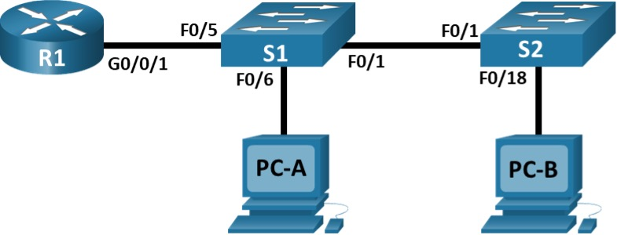
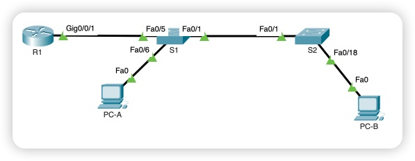
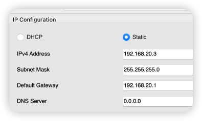
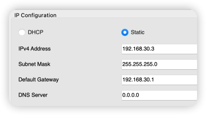

# Лабораторная работа - Внедрение маршрутизации между виртуальными локальными сетями

**Топология**



Таблица адресации

| Устройство | Интерфейс   | IP-адрес      | ПарольМаска подсети | Шлюз по умолчанию |
|------------|-------------|---------------|---------------------|-------------------|
| R1         | G0/0/1.10   | 192.168.10.1  | 255.255.255.0       | -                 |
|            | G0/0/1.20   | 192.168.20.1  | 255.255.255.0       | -                 |
|            | G0/0/1.30   | 192.168.30.1  | 255.255.255.0       | -                 |
|            | G0/0/1.1000 | -             |                     |                   |
| S1         | VLAN 10     | 192.168.10.11 | 255.255.255.0       | 192.168.10.1      |
| S1         | VLAN 10     | 192.168.10.12 | 255.255.255.0       | 192.168.10.1      |
| PC-A       |             | 192.168.20.3  | 255.255.255.0       | 192.168.20.1      |
| PC-B       |             | 192.168.30.3  | 255.255.255.0       | 192.168.30.1      |

Таблица VLAN

| VLAN | Имя         | Назначенный интерфейс                                     |
|------|-------------|-----------------------------------------------------------|
| 10   | Management  | S1: VLAN 10 S2: VLAN 10                                   |
| 20   | Sales       | S1: F0/6                                                  |
| 30   | Operations  | S2: F0/18                                                 |
| 999  | Parking_Lot | S1: F0/2-4, F0/7-24, G0/1-2 S2: F0/2-17, F0/19-24, G0/1-2 |


## Создание сети и настройка основных параметров устройства

Схема сети, созданная в Cisco Packet Tracer 



### Настроим базовые параметры:

1. Измененим имена устройств
2. Отключим поиск DNS
3. Изменим доменное имя
4. Назначим зашифрованный пароль для привилегированного режима EXEC
5. Назначим пароль для входа в консоль, включить вход в систему по паролю
6. Назначим пароль для входа в виртуальный терминал и активировать вход
	* Сгенерировать ключь для протокола SSH
	* Изменить версию протокола SSH на 2
	* Создать локального пользователя
	* Настроить авторизацию с помощью локального пользователя.
7.	Зашифровать открытые пароли
8. Создать баннер с предупреждение о запрете несанкционированного доступа к устройству
9. Сохранить конфигурацию

### Настроим узлы ПК

Сетевые настройки узла PC-A:



Сетнвые настройки узла PC-B:



## Создание сетей VLAN и назначение портов коммутатора

### Создадим VLAN на обоих коммутаторе. 

```
conf t
 vlan 10
  name Management
  exit
!
 vlan 20
  name Sales
  exit
!
 vlan 30
 name Operations
 exit
!
 vlan 999
  name Parking_Lot
  exit
!
 vlan 1000
  name Native VLAN
  exit      
```

### Выполним предварительные настройки портов:

1. Переведем все порты коммутаторов в VLAN 999
2. Переведем порты в режим доступа
3. Отключим согласование  DTP
4. Административно деактивируем

### Пример настройки на коммутаторе S1:
 
```
interface range fastEthernet 0/1-24, gigabitEthernet 0/1-2
 switchport mode access 
 switchport access vlan 999
 switchport nonegotiate
 shutdown
 exit
```

### Настроим интерфейс управления и шлюз по умолчанию на коммутаторах:

Пример настройки на коммутаторе S1:

```
conf t
 interface Vlan10
  description IP-address management
  ip address 192.168.10.11 255.255.255.0
!
 ip default-gateway 192.168.10.1
```

### Настроим порты доступа на коммутаторах

Настром порт FastEthernet 0/6 на коммутаторе S1:

```
conf t
 interface FastEthernet0/6
  switchport access vlan 20
  switchport mode access
  no shutdown
  exit
```

Настром порт FastEthernet 0/18 на коммутаторе S2:

```
conf t
 interface FastEthernet0/18
  switchport access vlan 30
  switchport mode access
  no shutdown
  exit
```

## Настроим магистральный канал стандарта 802.1Q между коммутаторами

1. Настроим статический транкинг на интерфейсе FastEthernet 0/1 для обоих коммутаторов
2. Настроим статический транкинг на интерфейсе FastEthernet 0/5 на коммутатор S1
3. Установим Native VLAN 1000 на обоих коммутаторах
4. Укажем, что VLAN 10, 20, 30 и 1000 могут проходить по транку

### Настроим статический транкинг на интерфейсе FastEthernet 0/1

```
conf t
 interface fastEthernet 0/1
  switchport mode trunk
  switchport trunk native vlan 1000
  switchport trunk allowed vlan 10,20,30,1000
  no shutdown 
  exit
```

### Настроим статический транкинг на интерфейсе FastEthernet 0/5

``` 
conf t
 interface fastEthernet 0/5
  switchport mode trunk
  switchport trunk native vlan 1000
  switchport trunk allowed vlan 10,20,30,1000
  no shutdown
  exit 
```

### Просмотр настроек VLAN и Trunk-портов

```
show vlan brief 
show interfaces trunk 
```

## Настроим маршрутизации между сетями VLAN

### Активируем интерфейс G0/0/1 на маршрутизаторе

```
conf t
 interface GigabitEthernet0/0/1
 no shutdown
 exit 
```

### Настроим подинтерфейсы для каждой VLAN:

```
conf t
 interface GigabitEthernet0/0/1.10
  description Management
  encapsulation dot1Q 10
  ip address 192.168.10.1 255.255.255.0
  exit
!
 interface GigabitEthernet0/0/1.20
  description Sales
  encapsulation dot1Q 20
  ip address 192.168.20.1 255.255.255.0
  exit
!
 interface GigabitEthernet0/0/1.30
  description Operations
  encapsulation dot1Q 30
  ip address 192.168.30.1 255.255.255.0
  exit
!
 interface GigabitEthernet0/0/1.1000
  encapsulation dot1Q 1000
  description Native VLAN
  no ip address
  exit
```

Часть 5. Проверьте, работает ли маршрутизация между VLAN

Отправим эхо-запрос с PC-A на шлюз по умолчанию.

```
C:\>ipconfig 

FastEthernet0 Connection:(default port)

   Connection-specific DNS Suffix..: 
   Link-local IPv6 Address.........: FE80::201:C7FF:FEE2:AC72
   IPv6 Address....................: ::
   IPv4 Address....................: 192.168.20.3
   Subnet Mask.....................: 255.255.255.0
   Default Gateway.................: ::
                                     192.168.20.1

C:\>ping 192.168.20.1

Pinging 192.168.20.1 with 32 bytes of data:

Reply from 192.168.20.1: bytes=32 time=26ms TTL=255
Reply from 192.168.20.1: bytes=32 time<1ms TTL=255
Reply from 192.168.20.1: bytes=32 time<1ms TTL=255
Reply from 192.168.20.1: bytes=32 time<1ms TTL=255
```

Отправим эхо-запрос с PC-A на PC-B.

```
C:\>ping 192.168.30.3

Pinging 192.168.30.3 with 32 bytes of data:

Reply from 192.168.30.3: bytes=32 time<1ms TTL=127
Reply from 192.168.30.3: bytes=32 time<1ms TTL=127
Reply from 192.168.30.3: bytes=32 time<1ms TTL=127
Reply from 192.168.30.3: bytes=32 time<1ms TTL=127
```

Отправим команду ping с компьютера PC-A на коммутатор S2.

```
C:\>ping 192.168.10.12

Pinging 192.168.10.12 with 32 bytes of data:

Request timed out.
Request timed out.
Reply from 192.168.10.12: bytes=32 time<1ms TTL=254
Reply from 192.168.10.12: bytes=32 time<1ms TTL=254
```

В окне командной строки на PC-B выполните команду tracert на адрес PC-A.

```
C:\>tracert 192.168.20.3

Tracing route to 192.168.20.3 over a maximum of 30 hops: 

  1   0 ms      0 ms      0 ms      192.168.30.1
  2   0 ms      0 ms      0 ms      192.168.20.3

Trace complete.
```

Вопрос: Какие промежуточные IP-адреса отображаются в результатах?
Ответ: Отображается IP-адрес шлюза по умолчанию, настроенные на PC-B

Вопрос: Что произойдет, если G0/0/1 на R1 будет отключен?
Ответ: На маршрутизаторе выключаться все созданные подинтерфейсы, на коммутаторе S1 интерфейс FastEthernet 0/5 перейдет в состояние Выключен и перейдет в VLAN 999, который является для этого интерфейса по умолчанию, в режим доступа.  

Конфигурация устройств находиться [здесь](configs/)


