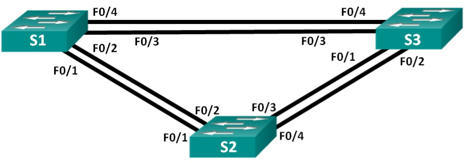
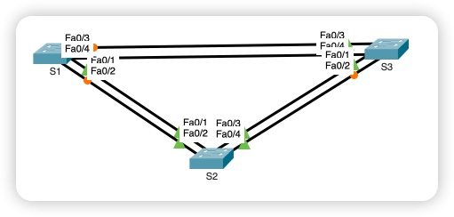

# Лабораторная работа. Развертывание коммутируемой сети с резервными каналами

**Топология**



**Таблица адресации**

| Устройство | Интерфейс | IP-адрес    | Маска подсети |
|------------|-----------|-------------|---------------|
| S1         | VLAN 1    | 192.168.1.1 | 255.255.255.0 |
| S2         | VLAN 1    | 192.168.1.2 | 255.255.255.0 |
| S3         | VLAN 1    | 192.168.1.3 | 255.255.255.0 |

## Задачи:

1. Настроить основные параметры устройств
2. Определить корневой мост
3. Наблюдение за процессом выбора протоколом STP порта, исходя из стоимости портов
4. Наблюдение за процессом выбора протоколом STP порта, исходя из приоретита портов

## Решение:

### Настройка основных параметров устройства

Схема сети согласно топологии



#### Инициализация и перезагрузка коммутаторов

```
erase startup-config
delete vlan.dat
reload
```

#### Настройка базовых параметров на примере коммутатора S1:

```
conf t
!
 hostname S1
 enable secret class
 service password-encryption
!
 no ip domain-lookup
 ip domain-name otus.ru
!
 crypto key generate rsa general-keys modulus 2048
 ip ssh version 2
!
 username sshadmin privilege 15 secret cisco
!
 line vty 0 4
  password cisco
  login local
  transport input ssh
  exit
!
 line console 0
  password cisco
  login
  logging synchronous
  exit
!
 banner motd ^C !!ATTENSION!! Unautorized access is prohibited^C
!
 interface vlan 1
  description Management IP-Address
  ip address 192.168.1.1 255.255.255.0
  exit
```

#### Проверим спсобность коммутаторов обмениваться эхо-запросами:

Успешно ли выполняется эхо-запрос от коммутатора S1 на коммутатор S2? Успешно.  
Успешно ли выполняется эхо-запрос от коммутатора S1 на коммутатор S3? Успешно.  
Успешно ли выполняется эхо-запрос от коммутатора S2 на коммутатор S3? Успешно.  

### Определение корневого моста

#### Задачи:

1. Отключить все порты на всех устройствах
2. Перевести подключенные порты в trunk
3. Включить порты FastEthernet 0/2 и FastEthernet 0/4
4. Просмотреть данные протокола Spanning-Tree
5. Отобразить роль и состояние активных портов на каждом коммутаторе в топологии
6. Ответить на вопросы

#### Пример отключения всех портов:

```
conf t
!
  interface range FastEthernet 0/1-24, GigabitEthernet 0/1-2
    shutdown
    exit
```

#### Пример настройки подключенных портов в режим транка:

```
conf t
!
 interface range fastEthernet 0/1-4
   switchport mode trunk
   exit
```

#### Пример включения портов FastEthernet 0/2 и FastEthernet 0/4:

```
conf t
!
 interface range fastEthernet 0/2, fastEthernet 0/4
  no shutdown
  exit
``` 
#### Просмотр данных протокола STP на устройствах

##### Данные протокола spanning-tree на коммутаторе S1:

```
VLAN0001
  Spanning tree enabled protocol ieee
  Root ID    Priority    32769
             Address     0001.4354.86E1
             Cost        19
             Port        2(FastEthernet0/2)
             Hello Time  2 sec  Max Age 20 sec  Forward Delay 15 sec

  Bridge ID  Priority    32769  (priority 32768 sys-id-ext 1)
             Address     0060.3ED6.7145
             Hello Time  2 sec  Max Age 20 sec  Forward Delay 15 sec
             Aging Time  20

Interface        Role Sts Cost      Prio.Nbr Type
---------------- ---- --- --------- -------- --------------------------------
Fa0/4            Altn BLK 19        128.4    P2p
Fa0/2            Root FWD 19        128.2    P2p
```

##### Данные протокола spanning-tree на коммутаторе S2:

```
LAN0001
  Spanning tree enabled protocol ieee
  Root ID    Priority    32769
             Address     0001.4354.86E1
             This bridge is the root
             Hello Time  2 sec  Max Age 20 sec  Forward Delay 15 sec

  Bridge ID  Priority    32769  (priority 32768 sys-id-ext 1)
             Address     0001.4354.86E1
             Hello Time  2 sec  Max Age 20 sec  Forward Delay 15 sec
             Aging Time  20

Interface        Role Sts Cost      Prio.Nbr Type
---------------- ---- --- --------- -------- --------------------------------
Fa0/4            Desg FWD 19        128.4    P2p
Fa0/2            Desg FWD 19        128.2    P2p
```

##### Данные протокола spanning-tree на коммутаторе S3:

```
VLAN0001
  Spanning tree enabled protocol ieee
  Root ID    Priority    32769
             Address     0001.4354.86E1
             Cost        19
             Port        2(FastEthernet0/2)
             Hello Time  2 sec  Max Age 20 sec  Forward Delay 15 sec

  Bridge ID  Priority    32769  (priority 32768 sys-id-ext 1)
             Address     0002.4A06.C995
             Hello Time  2 sec  Max Age 20 sec  Forward Delay 15 sec
             Aging Time  20

Interface        Role Sts Cost      Prio.Nbr Type
---------------- ---- --- --------- -------- --------------------------------
Fa0/2            Root FWD 19        128.2    P2p
Fa0/4            Desg FWD 19        128.4    P2p
```

##### Роль и состояние активных портов на каждом коммутаторе в топологии:

Данные коммутатора S1:

MAC: 0060.3ED6.7145

Таблица - роль и состояние активных портов
    
| Порт  | Роль | Статус |
|-------|------|--------|
| Fa0/4 | Altn | BLK    |
| Fa0/2 | Root | FWD    |

Данные коммутатора S2:

MAC: 0001.4354.86E1

Таблица - роль и состояние активных портов
    
| Порт  | Роль | Статус |
|-------|------|--------|
| Fa0/4 | Desg | FWD    |
| Fa0/2 | Desg | FWD    |

Данные коммутатора S3:

MAC: 0002.4A06.C995

Таблица - роль и состояние активных портов
    
| Порт  | Роль | Статус |
|-------|------|--------|
| Fa0/2 | Root | FWD    |
| Fa0/4 | Desg | FWD    |

#### Вопросы:

В1: Какой коммутатор является корневым мостом?   
О: Коммутатор S2

В2: Почему этот коммутатор был выбран протоколом spanning-tree в качестве корневого моста?
О: Мост с наименьшим идентификатором (Bridge ID) является корневым мостом. Bridge ID формируется на основе приоритета и MAC-адреса. У всех коммутаторов приоритет по умолчанию - 32 769 (32 768 + sys-id-ext равное 1). Поэтому выбор падает на коммутатор, у которого самый низкий MAC-адрес.

В3: Какие порты на коммутаторе являются корневыми портами?    
О: У коммутаора S2 отсутствуют корневые порты

В4: Какие порты на коммутаторе являются назначенными портами?    
О: У коммутаора S2 имеется два назначенных порта: FastEthernet 0/2 и FastEthernet 0/4 

В5: Какой порт отображается в качестве альтернативного и в настоящее время заблокирован? 
О: На коммутаторе S1 порт FastEthernet 0/4 отображается в качестве альтернативного и заблокирован

В6: Почему протокол spanning-tree выбрал этот порт в качестве невыделенного (заблокированного) порта?
О: Также на основе Bridge ID. Так как приоритеты равны, то выбирается по наименьшему MAC-адресу.


### Наблюдение за процессом выбора протоколом STP порта, исходя из стоимости портов

#### Коммутатор S1 с заблокированным портом:

```
S1#show spanning-tree
VLAN0001
  Spanning tree enabled protocol ieee
  Root ID    Priority    32769
             Address     0001.4354.86E1
             Cost        19
             Port        2(FastEthernet0/2)
             Hello Time  2 sec  Max Age 20 sec  Forward Delay 15 sec

  Bridge ID  Priority    32769  (priority 32768 sys-id-ext 1)
             Address     0060.3ED6.7145
             Hello Time  2 sec  Max Age 20 sec  Forward Delay 15 sec
             Aging Time  20

Interface        Role Sts Cost      Prio.Nbr Type
---------------- ---- --- --------- -------- --------------------------------
Fa0/4            Altn BLK 19        128.4    P2p
Fa0/2            Root FWD 19        128.2    P2p
```

#### Пример настройки стоимости порта FastEthernet 0/2:

```
conf t
!
 interface fastEthernet 0/2
  spanning-tree vlan 1 cost 18
  exit
```

#### Просмотр изменения протокола spanning-tree

##### Данные протокола spanning-tree на коммутаторе S1:

```
S1#show spanning-tree 
VLAN0001
  Spanning tree enabled protocol ieee
  Root ID    Priority    32769
             Address     0001.4354.86E1
             Cost        18
             Port        2(FastEthernet0/2)
             Hello Time  2 sec  Max Age 20 sec  Forward Delay 15 sec

  Bridge ID  Priority    32769  (priority 32768 sys-id-ext 1)
             Address     0060.3ED6.7145
             Hello Time  2 sec  Max Age 20 sec  Forward Delay 15 sec
             Aging Time  20

Interface        Role Sts Cost      Prio.Nbr Type
---------------- ---- --- --------- -------- --------------------------------
Fa0/2            Root FWD 18        128.2    P2p
Fa0/4            Desg FWD 19        128.4    P2p
```

##### Данные протокола spanning-tree на коммутаторе S2:

```
S2#show spanning-tree 
VLAN0001
  Spanning tree enabled protocol ieee
  Root ID    Priority    32769
             Address     0001.4354.86E1
             This bridge is the root
             Hello Time  2 sec  Max Age 20 sec  Forward Delay 15 sec

  Bridge ID  Priority    32769  (priority 32768 sys-id-ext 1)
             Address     0001.4354.86E1
             Hello Time  2 sec  Max Age 20 sec  Forward Delay 15 sec
             Aging Time  20

Interface        Role Sts Cost      Prio.Nbr Type
---------------- ---- --- --------- -------- --------------------------------
Fa0/2            Desg FWD 19        128.2    P2p
Fa0/4            Desg FWD 19        128.4    P2p
```

##### Данные протокола spanning-tree на коммутаторе S3:

```
VLAN0001
  Spanning tree enabled protocol ieee
  Root ID    Priority    32769
             Address     0001.4354.86E1
             Cost        19
             Port        2(FastEthernet0/2)
             Hello Time  2 sec  Max Age 20 sec  Forward Delay 15 sec

  Bridge ID  Priority    32769  (priority 32768 sys-id-ext 1)
             Address     0002.4A06.C995
             Hello Time  2 sec  Max Age 20 sec  Forward Delay 15 sec
             Aging Time  20

Interface        Role Sts Cost      Prio.Nbr Type
---------------- ---- --- --------- -------- --------------------------------
Fa0/2            Root FWD 19        128.2    P2p
Fa0/4            Altn BLK 19        128.4    P2p
```

Вопрос: Почему протокол spanning-tree заменяет ранее заблокированный порт на назначенный порт и блокирует порт, который был назначенным портом на другом коммутаторе?    
Ответ: После уменьшил стоимости заблокированного порта на коммутаторе S1 до 18 протокол spanning-tree изменяет его роль на назначенный. Порта FastEthernet 0/4 на коммутаторе S3, который имел роль назначенный, протокол spanning-tree изменил его на роль альтернативный основываясь на наименьший приоритет порта - у порта FastEthernet 0/4 приоритет равен 128.4. Чем выше значение, тем меньше приоритет.

#### Удаление стоимости порта FastEthernet 0/2 на коммутаторе S1:

```
S1(config)# interface fastEthernet 0/2
S1(config-if)#  no spanning-tree vlan 1 cost 18
```

##### Данные протокола spanning-tree на коммутаторе S1:

```
S1#show spanning-tree 
VLAN0001
  Spanning tree enabled protocol ieee
  Root ID    Priority    32769
             Address     0001.4354.86E1
             Cost        19
             Port        2(FastEthernet0/2)
             Hello Time  2 sec  Max Age 20 sec  Forward Delay 15 sec

  Bridge ID  Priority    32769  (priority 32768 sys-id-ext 1)
             Address     0060.3ED6.7145
             Hello Time  2 sec  Max Age 20 sec  Forward Delay 15 sec
             Aging Time  20

Interface        Role Sts Cost      Prio.Nbr Type
---------------- ---- --- --------- -------- --------------------------------
Fa0/2            Root FWD 19        128.2    P2p
Fa0/4            Altn BLK 19        128.4    P2p
```

### Наблюдение за процессом выбора протоколом STP порта, исходя из приоритета портов

#### Включим порты F0/1 и F0/3 на всех коммутаторах (Пример для коммутатора S1):

```
conf t
!
 interface range fastEthernet 0/1, fastEthernet 0/3
 no shutdown
 exit
```

#### Отобразим изменения протокола spanning-tree

##### Данные протокола spanning-tree на коммутаторе S1:

```
S1#show spanning-tree 
VLAN0001
  Spanning tree enabled protocol ieee
  Root ID    Priority    32769
             Address     0001.4354.86E1
             Cost        19
             Port        1(FastEthernet0/1)
             Hello Time  2 sec  Max Age 20 sec  Forward Delay 15 sec

  Bridge ID  Priority    32769  (priority 32768 sys-id-ext 1)
             Address     0060.3ED6.7145
             Hello Time  2 sec  Max Age 20 sec  Forward Delay 15 sec
             Aging Time  20

Interface        Role Sts Cost      Prio.Nbr Type
---------------- ---- --- --------- -------- --------------------------------
Fa0/1            Root FWD 19        128.1    P2p
Fa0/2            Altn BLK 19        128.2    P2p
Fa0/3            Altn BLK 19        128.3    P2p
Fa0/4            Altn BLK 19        128.4    P2p
```

##### Данные протокола spanning-tree на коммутаторе S2:

```
VLAN0001
  Spanning tree enabled protocol ieee
  Root ID    Priority    32769
             Address     0001.4354.86E1
             This bridge is the root
             Hello Time  2 sec  Max Age 20 sec  Forward Delay 15 sec

  Bridge ID  Priority    32769  (priority 32768 sys-id-ext 1)
             Address     0001.4354.86E1
             Hello Time  2 sec  Max Age 20 sec  Forward Delay 15 sec
             Aging Time  20

Interface        Role Sts Cost      Prio.Nbr Type
---------------- ---- --- --------- -------- --------------------------------
Fa0/1            Desg FWD 19        128.1    P2p
Fa0/2            Desg FWD 19        128.2    P2p
Fa0/3            Desg FWD 19        128.3    P2p
Fa0/4            Desg FWD 19        128.4    P2p
```

##### Данные протокола spanning-tree на коммутаторе S3:

```
S3#show spanning-tree 
VLAN0001
  Spanning tree enabled protocol ieee
  Root ID    Priority    32769
             Address     0001.4354.86E1
             Cost        19
             Port        1(FastEthernet0/1)
             Hello Time  2 sec  Max Age 20 sec  Forward Delay 15 sec

  Bridge ID  Priority    32769  (priority 32768 sys-id-ext 1)
             Address     0002.4A06.C995
             Hello Time  2 sec  Max Age 20 sec  Forward Delay 15 sec
             Aging Time  20

Interface        Role Sts Cost      Prio.Nbr Type
---------------- ---- --- --------- -------- --------------------------------
Fa0/1            Root FWD 19        128.1    P2p
Fa0/2            Altn BLK 19        128.2    P2p
Fa0/3            Desg FWD 19        128.3    P2p
Fa0/4            Desg FWD 19        128.4    P2p
```

#### Вопросы:

В1: Какой порт выбран протоколом STP в качестве порта корневого моста на каждом коммутаторе некорневого моста?   
О: На коммутаторах S1 и S2 выбран порт FastEthernet 0/1 в качестве корневого моста

В2: Почему протокол STP выбрал эти порты в качестве портов корневого моста на этих коммутаторах?    
О: Так как цена порта у всех портов одинакова, то выбор осуществлялся на основе приоритета порта. У интерфейса FastEtherne 0/1 он наименьший и равен 128.1
