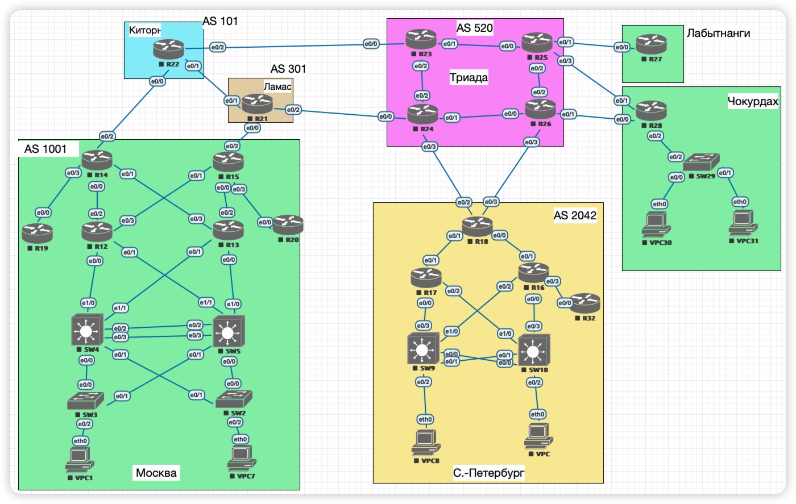

# Курс Network Engineer Professional
## Домашнее задание

Задание: 

1.	Распределение адресного пространства для лабораторного стенда

**Базовая схема:**

### 1. Распределение адресного пространства

-	[Автономные системы и принадлежащие им публичные адреса сетей](docs/addresses.md)
- 	[Таблица используемых подсетей IPv4](docs/subnets_ipv4.md) 
-  [Таблица назначенных сетевых адресов на интерфейсах маршрутизаторов](docs/address_allocation.md)

### 2. Маршрутизация

-	[Статическая маршрутизация](docs/static_routing.md)
- 	[PBR](docs/PBR.md)

#### 2.1. Динамическая маршрутизация
-	[Протокол маршрутизации OSPF](docs\OSPF.md)

