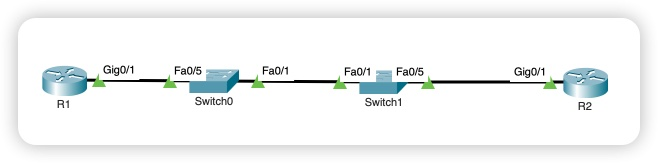

# Лабораторная работа. Настройка протокола OSPFv2 для одной области

Топология
 
Таблица адресации
Устройство	Интерфейс	IP-адрес	Маска подсети 
R1	G0/0/1	10.53.0.1	255.255.255.0
R1	Loopback1	172.16.1.1	255.255.255.0
R2	G0/0/1	10.53.0.2	255.255.255.0
R2	Loopback1	192.168.1.1	255.255.255.0

## Цели

Часть 1. Создание сети и настройка основных параметров устройства.   
Часть 2. Настройка и проверка базовой работы протокола  OSPFv2 для одной области.  
Часть 3. Оптимизация и проверка конфигурации OSPFv2 для одной области.  

## Часть 1. Создание сети и настройка основных параметров устройства

### Создание сети согласно топологии



### Шаг 2. Произведем базовую настройку маршрутизаторов (Пример для R1).

```
conf t
!
 hostname R1
 enable secret class
 service password-encryption
!
 no ip domain-lookup
 ip domain-name otus.ru
!
 crypto key generate rsa general-keys modulus 2048
 ip ssh version 2
!
 username sshadmin privilege 15 secret cisco
!
 line vty 0 4
  password cisco
  login local
  transport input ssh
  exit
!
 line console 0
  password cisco
  login
  logging synchronous
  exit	
!
 banner motd ^C !!ATTENSION!! Unautorized access is prohibited^C
```

### Шаг 3. Настроим базовые параметры каждого коммутатора (Пример для S1).

```
conf t
!
 hostname S1
 enable secret class
 service password-encryption
!
 no ip domain-lookup
 ip domain-name otus.ru
!
 crypto key generate rsa general-keys modulus 2048
 ip ssh version 2
!
 username sshadmin privilege 15 secret cisco
!
 line vty 0 4
  password cisco
  login local
  transport input ssh
  exit
!
 line console 0
  password cisco
  login
  logging synchronous
  exit	
!
 banner motd ^C !!ATTENSION!! Unautorized access is prohibited^C
```

## Часть 2. Настройка и проверка базовой работы протокола OSPFv2 для одной области

### Шаг 1. Настроим адреса интерфейса и базового OSPFv2 на каждом маршрутизаторе.

Пример настройки маршрутизатора R1

```
configure terminal
!
interface Loopback1
 ip address 172.16.1.1 255.255.255.0
 !
interface GigabitEthernet0/1
 ip address 10.53.0.1 255.255.255.0
 ip ospf 56 area 0
!
router ospf 56
 router-id 1.1.1.1
 log-adjacency-changes
 passive-interface default
 no passive-interface GigabitEthernet0/1
 auto-cost reference-bandwidth 10000
```

Пример настройки маршрутизатора R1

```
configure terminal
!
interface Loopback1
 ip address 192.168.1.1 255.255.255.0
 ip ospf 56 area 0
!
interface GigabitEthernet0/1
 ip address 10.53.0.2 255.255.255.0
 ip ospf 56 area 0
!
router ospf 56
 router-id 2.2.2.2
 log-adjacency-changes
 passive-interface default
 no passive-interface GigabitEthernet0/1
 auto-cost reference-bandwidth 10000
```

### Проверим смежность между марщрутизаторами (Пример на R1):

```
R1#show ip ospf neighbor 


Neighbor ID     Pri   State           Dead Time   Address         Interface
2.2.2.2           1   FULL/DR         00:00:34    10.53.0.2       GigabitEthernet0/1
```

Маршрутизатор R1 является BDR, R2 - DR.

### Проверим, что сеть R2 loopback1 присутствует в таблице машрутизации R1:

```
R1#show ip route ospf 
     192.168.1.0/32 is subnetted, 1 subnets
O       192.168.1.1 [110/101] via 10.53.0.2, 00:03:00, GigabitEthernet0/1
```

### Запустим Ping до  адреса интерфейса R2 Loopback 1 из R1

```
R1#ping 192.168.1.1

Type escape sequence to abort.
Sending 5, 100-byte ICMP Echos to 192.168.1.1, timeout is 2 seconds:
!!!!!
Success rate is 100 percent (5/5), round-trip min/avg/max = 0/0/0 ms
```

## Часть 3. Оптимизация и проверка конфигурации OSPFv2 для одной области

### Шаг 1. Реализация различных оптимизаций на каждом маршрутизаторе

#### a.	На R1 настроим приоритет OSPF интерфейса G0/0/1 на 50

```
configurq terminal
!
interface GigabitEthernet0/1
 ip ospf priority 50
```

Перезапустим протокол OSPF `clear ip ospf process`

Проверим, что маршрутизатор R1 являеься назначеным:

```
R1#show ip ospf neighbor 


Neighbor ID     Pri   State           Dead Time   Address         Interface
2.2.2.2           1   FULL/BDR        00:00:32    10.53.0.2       GigabitEthernet0/1
```

#### b.	Настроим таймеры OSPF на G0/0/1 каждого маршрутизатора для таймера приветствия, составляющего 30 секунд.

Пример для R1:

```
configure terminal
!
interface GigabitEthernet0/1
 ip ospf hello-interval 30
```

#### c.	На R1 настроим статический маршрут по умолчанию, который использует интерфейс Loopback 1 в качестве интерфейса выхода. Затем распространим маршрут по умолчанию в OSPF

```
configure terminal
!
ip route 0.0.0.0 0.0.0.0 Loopback1 
!
router ospf 56
 default-information originate
```

#### d.	добавим конфигурацию, необходимую для OSPF для обработки R2 Loopback 1 как сети точка-точка.

```
configure terminal
!
interface Loopback1
 ip ospf network point-to-point
```

Убедимся, что интерфейс Loopback1 являктся сетью точка-точка:

```
R2#show ip ospf interface loopback 1

Loopback1 is up, line protocol is up
  Internet address is 192.168.1.1/24, Area 0
  Process ID 56, Router ID 2.2.2.2, Network Type POINT-TO-POINT, Cost: 1
  Transmit Delay is 1 sec, State POINT-TO-POINT,
  ...
```

#### e.	Только на R2 добавьте конфигурацию, необходимую для предотвращения отправки объявлений OSPF в сеть Loopback 1.

```
configure terminal
!
router ospf 56
 passive-interface Loopback1
```

#### f.	Измените базовую пропускную способность для маршрутизаторов:

Пример для R1:

```
router ospf 56
 auto-cost reference-bandwidth 10000
```
