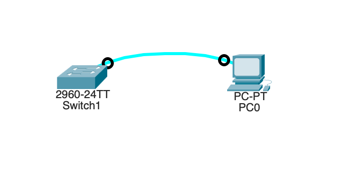
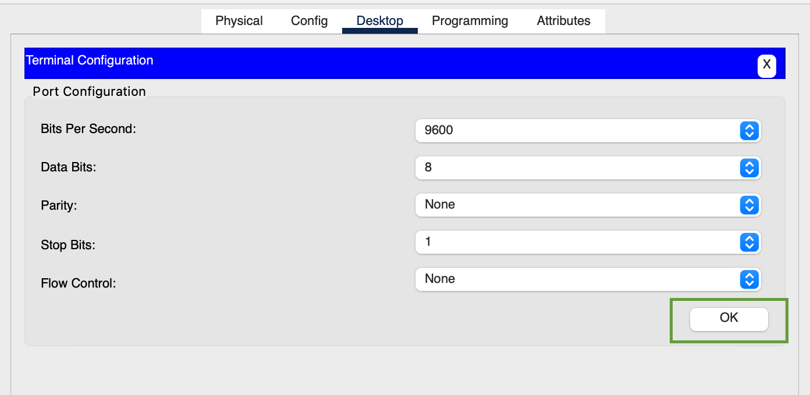
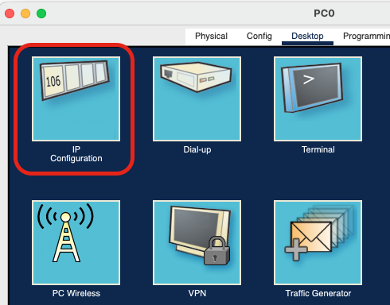
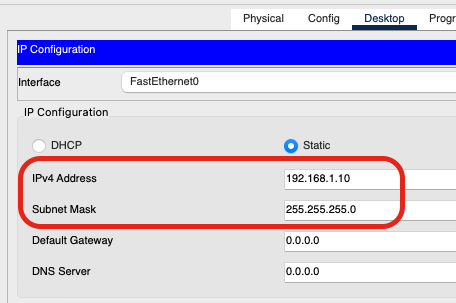

# Лабораторная работа. Базовая настройка коммутатора

### Топология


### Таблица адресации

| Устройство  | Интерфейс   | IP-адрес / префикс  |
|----------:|:---------:|:------------------|
| S1          | VLAN 1      | 192.168.1.2/24      |
| PC-A        | NIC         | 192.168.1.10/24     |

### Задачи
**Часть 1. Проверка конфигурации коммутатора по умолчанию**.  
**Часть 2. Создание сети и настройка основных параметров устройства**   

* Настройте базовые параметры коммутатора.  
* Настройте IP-адрес для ПК.

**Часть 3. Проверка сетевых подключений**.  

* Отобразите конфигурацию устройства.
* Протестируйте сквозное соединение, отправив эхо-запрос.
* Протестируйте возможности удаленного управления с помощью Telnet.


## Решение

### Часть 1. Создание сети и проверка настроек коммутатора по умолчанию

### Шаг 1. Создать сеть согласно топологии.

#### Подсоденить консольный кабель
	

	
#### Установить консольное подключение к коммутатору

- На компьютере открыть терминал


-  Определить параметры подключения



- Вывод консоли

```
Switch Ports Model              SW Version            SW Image
------ ----- -----              ----------            ----------
*    1 26    WS-C2960-24TT-L    15.0(2)SE4            C2960-LANBASEK9-M

Cisco IOS Software, C2960 Software (C2960-LANBASEK9-M), Version 15.0(2)SE4, RELEASE SOFTWARE (fc1)
Technical Support: http://www.cisco.com/techsupport
Copyright (c) 1986-2013 by Cisco Systems, Inc.
Compiled Wed 26-Jun-13 02:49 by mnguyen


Press RETURN to get started!


%LINK-5-CHANGED: Interface FastEthernet0/1, changed state to up

%LINEPROTO-5-UPDOWN: Line protocol on Interface FastEthernet0/1, changed state to up

%LINK-3-UPDOWN: Interface FastEthernet0/1, changed state to down

%LINEPROTO-5-UPDOWN: Line protocol on Interface FastEthernet0/1, changed state to down


Switch>
```

### Шаг 2. Проверьте настройки коммутатора по умолчанию.

Войти в привилегированный режим EXEC с помощью команды `enable`

Выполнить команду show running-config

```
Switch#show run
Building configuration...

Current configuration : 1080 bytes
!
version 15.0
no service timestamps log datetime msec
no service timestamps debug datetime msec
no service password-encryption
!
hostname Switch
!
!
!
!
!
!
spanning-tree mode pvst
spanning-tree extend system-id
!
interface FastEthernet0/1
!
interface FastEthernet0/2
!
interface FastEthernet0/3
!
interface FastEthernet0/4
!
interface FastEthernet0/5
!
interface FastEthernet0/6
!
interface FastEthernet0/7
!
interface FastEthernet0/8
!
interface FastEthernet0/9
!
interface FastEthernet0/10
!
interface FastEthernet0/11
!
interface FastEthernet0/12
!
interface FastEthernet0/13
!
interface FastEthernet0/14
!
interface FastEthernet0/15
!
interface FastEthernet0/16
!
interface FastEthernet0/17
!
interface FastEthernet0/18
!
interface FastEthernet0/19
!
interface FastEthernet0/20
!
interface FastEthernet0/21
!
interface FastEthernet0/22
!
interface FastEthernet0/23
!
interface FastEthernet0/24
!
interface GigabitEthernet0/1
!
interface GigabitEthernet0/2
!
interface Vlan1
 no ip address
 shutdown
!
!
!
!
line con 0
!
line vty 0 4
 login
line vty 5 15
 login
!
!
!
!
end


Switch#
```

#### b.	Изучите текущий файл running configuration.

Сколько интерфейсов FastEthernet имеется на коммутаторе 2960? - `24`

Сколько интерфейсов Gigabit Ethernet имеется на коммутаторе 2960? - `2`

Каков диапазон значений, отображаемых в vty-линиях? - `16`

#### c.	Изучите файл загрузочной конфигурации (startup configuration), который содержится в энергонезависимом ОЗУ (NVRAM).

Почему появляется это сообщение? - Потому что файл конфигурации не сохранен в энергонезависимую память (NVRAM) и в настоящее время находиться в оперативной памяти.


#### d.	Изучите характеристики SVI для VLAN 1.

Назначен ли IP-адрес сети VLAN 1? - IP-адрес сети VLAN 1 не назначен.  
Какой MAC-адрес имеет SVI? Возможны различные варианты ответов. - 0060.47e1.227c.  
Данный интерфейс включен? - Данный интерфейс выключен.  

Вывод консоли [здесь](output-cons/p1-s2-d.txt)

#### e.	Изучите IP-свойства интерфейса SVI сети VLAN 1.  
Какие выходные данные вы видите?

Вывод консоли:

```
Switch#show ip interface vlan 1
Vlan1 is administratively down, line protocol is down
  Internet protocol processing disabled
```

#### f.	Подсоедините кабель Ethernet компьютера PC-A к порту 6 на коммутаторе и изучите IP-свойства интерфейса SVI сети VLAN 1. Дождитесь согласования параметров скорости и дуплекса между коммутатором и ПК. 

Какие выходные данные вы видите?

```
Switch#show interfaces vlan 1
Vlan1 is administratively down, line protocol is down
  Hardware is CPU Interface, address is 0060.47e1.227c (bia 0060.47e1.227c)
  MTU 1500 bytes, BW 100000 Kbit, DLY 1000000 usec,
     reliability 255/255, txload 1/255, rxload 1/255
  Encapsulation ARPA, loopback not set
  ARP type: ARPA, ARP Timeout 04:00:00
  Last input 21:40:21, output never, output hang never
  Last clearing of "show interface" counters never
  Input queue: 0/75/0/0 (size/max/drops/flushes); Total output drops: 0
  Queueing strategy: fifo
  Output queue: 0/40 (size/max)
  5 minute input rate 0 bits/sec, 0 packets/sec
  5 minute output rate 0 bits/sec, 0 packets/sec
     1682 packets input, 530955 bytes, 0 no buffer
     Received 0 broadcasts (0 IP multicast)
     0 runts, 0 giants, 0 throttles
     0 input errors, 0 CRC, 0 frame, 0 overrun, 0 ignored
     563859 packets output, 0 bytes, 0 underruns
     0 output errors, 23 interface resets
     0 output buffer failures, 0 output buffers swapped out
```

#### g.	Изучите сведения о версии ОС Cisco IOS на коммутаторе.   

Под управлением какой версии ОС Cisco IOS работает коммутатор? - Version 15.0(2)SE4.  
Как называется файл образа системы? - c2960-lanbasek9-mz.150-2.SE4.bin.  

Вывод консоли [здесь](output-cons/p1-s2-g.txt)

#### h.	Изучите свойства по умолчанию интерфейса FastEthernet, который используется компьютером PC-A.  
Switch# show interface f0/6  
 
Интерфейс включен или выключен? - Интерфейс включен.  
Что нужно сделать, чтобы включить интерфейс? - no shutdown.  
Какой MAC-адрес у интерфейса? - 0060.5c44.b406.  
Какие настройки скорости и дуплекса заданы в интерфейсе? - Full-duplex, 100Mb/s.  

Вывод консоли [здесь](output-cons/p1-s2-h.txt)

#### i.	Изучите флеш-память.  
Выполните одну из следующих команд, чтобы изучить содержимое флеш-каталога.  
Switch# show flash  
Switch# dir flash:  
В конце имени файла указано расширение, например .bin. Каталоги не имеют расширения файла.

Какое имя присвоено образу Cisco IOS? - 2960-lanbasek9-mz.150-2.SE4.bin

	Switch#show flash
	Directory of flash:/

    1  -rw-     4670455          <no date>  2960-lanbasek9-mz.150-2.SE4.bin

	64016384 bytes total (59345929 bytes free) 

================================

	Switch#dir flash: 
	Directory of flash:/

    1  -rw-     4670455          <no date>  2960-lanbasek9-mz.150-2.SE4.bin

	64016384 bytes total (59345929 bytes free)

## Часть 2. Настройка базовых параметров сетевых устройств.  

### Шаг 1. Настройте базовые параметры коммутатора.

#### a.	В режиме глобальной конфигурации скопируйте следующие базовые параметры конфигурации и вставьте их в файл на коммутаторе S1.  

```
conf t
!
service password-encryption
!
hostname S1
!
enable secret 5 $1$mERr$9cTjUIEqNGurQiFU.ZeCi1
!
!
!
no ip domain-lookup
!
!
!
banner motd ^C

Unauthorized access is strictly prohibited. ^C
!
```


#### b.	Назначьте IP-адрес интерфейсу SVI на коммутаторе. Благодаря этому вы получите возможность удаленного управления коммутатором.

```
conf t
!
interface Vlan1
 ip address 192.168.1.2 255.255.255.0
 shutdown

```

#### c.	Доступ через порт консоли также следует ограничить  с помощью пароля. Используйте cisco в качестве пароля для входа в консоль в этом задании. Конфигурация по умолчанию разрешает все консольные подключения без пароля. Чтобы консольные сообщения не прерывали выполнение команд, используйте параметр logging synchronous.
S1(config)# line con 0
S1(config-line)# logging synchronous 

```
!
line con 0
 password 7 0822455D0A16
 logging synchronous
 login
!
```

#### d.	Настройте каналы виртуального соединения для удаленного управления (vty), чтобы коммутатор разрешил доступ через Telnet. Если не настроить пароль VTY, будет невозможно подключиться к коммутатору по протоколу Telnet.

Для чего нужна команда login? - Команда login нужна для включения доступа к пользовательскому режиму EXEC

```
!
line vty 0 4
 password 7 0822455D0A16
 login
 transport input telnet
line vty 5 15
 login
!
```

### Шаг 2. Настройте IP-адрес на компьютере PC-A.

Открыть IP Configuration



Ввести IP-адрес и маску



## Часть 3. Проверка сетевых подключений

### Шаг 1. Отобразите конфигурацию коммутатора.

#### a. Отобразить текущую конфигурацию

```
S1#sh run
Building configuration...

Current configuration : 1353 bytes
!
version 15.0
no service timestamps log datetime msec
no service timestamps debug datetime msec
service password-encryption
!
hostname S1
!
enable secret 5 $1$mERr$9cTjUIEqNGurQiFU.ZeCi1
!
!
!
no ip domain-lookup
!
!
!
spanning-tree mode pvst
spanning-tree extend system-id
!
interface FastEthernet0/1
!
interface FastEthernet0/2
!
interface FastEthernet0/3
!
interface FastEthernet0/4
!
interface FastEthernet0/5
!
interface FastEthernet0/6
!
interface FastEthernet0/7
!
interface FastEthernet0/8
!
interface FastEthernet0/9
!
interface FastEthernet0/10
!
interface FastEthernet0/11
!
interface FastEthernet0/12
!
interface FastEthernet0/13
!
interface FastEthernet0/14
!
interface FastEthernet0/15
!
interface FastEthernet0/16
!
interface FastEthernet0/17
!
interface FastEthernet0/18
!
interface FastEthernet0/19
!
interface FastEthernet0/20
!
interface FastEthernet0/21
!
interface FastEthernet0/22
!
interface FastEthernet0/23
!
interface FastEthernet0/24
!
interface GigabitEthernet0/1
!
interface GigabitEthernet0/2
!
interface Vlan1
 ip address 192.168.1.2 255.255.255.0
 shutdown
!
banner motd ^C

Unauthorized access is strictly prohibited. ^C
!
!
!
line con 0
 password 7 0822455D0A16
 logging synchronous
 login
!
line vty 0 4
 password 7 0822455D0A16
 login
 transport input telnet
line vty 5 15
 password 7 0822455D0A16
 login
!
!
!
!
end
```

#### b.	Проверьте параметры VLAN 1.

```
S1#sh interfaces vlan 1
Vlan1 is up, line protocol is up
  Hardware is CPU Interface, address is 0060.47e1.227c (bia 0060.47e1.227c)
  Internet address is 192.168.1.2/24
  MTU 1500 bytes, BW 100000 Kbit, DLY 1000000 usec,
     reliability 255/255, txload 1/255, rxload 1/255
  Encapsulation ARPA, loopback not set
  ARP type: ARPA, ARP Timeout 04:00:00
  Last input 21:40:21, output never, output hang never
  Last clearing of "show interface" counters never
  Input queue: 0/75/0/0 (size/max/drops/flushes); Total output drops: 0
  Queueing strategy: fifo
  Output queue: 0/40 (size/max)
  5 minute input rate 0 bits/sec, 0 packets/sec
  5 minute output rate 0 bits/sec, 0 packets/sec
     1682 packets input, 530955 bytes, 0 no buffer
     Received 0 broadcasts (0 IP multicast)
     0 runts, 0 giants, 0 throttles
     0 input errors, 0 CRC, 0 frame, 0 overrun, 0 ignored
     563859 packets output, 0 bytes, 0 underruns
     0 output errors, 23 interface resets
     0 output buffer failures, 0 output buffers swapped out
```

Какова полоса пропускания этого интерфейса? - BW 100000 Kbit

### Шаг 2. Протестируйте сквозное соединение, отправив эхо-запрос.

#### a.	В командной строке компьютера PC-A с помощью утилиты ping проверьте связь сначала с адресом PC-A.

```
Cisco Packet Tracer PC Command Line 1.0
C:\>ping 192.168.1.10

Pinging 192.168.1.10 with 32 bytes of data:

Reply from 192.168.1.10: bytes=32 time=15ms TTL=128
Reply from 192.168.1.10: bytes=32 time=13ms TTL=128
Reply from 192.168.1.10: bytes=32 time<1ms TTL=128
Reply from 192.168.1.10: bytes=32 time=12ms TTL=128

Ping statistics for 192.168.1.10:
    Packets: Sent = 4, Received = 4, Lost = 0 (0% loss),
Approximate round trip times in milli-seconds:
    Minimum = 0ms, Maximum = 15ms, Average = 10ms
```

#### b.	Из командной строки компьютера PC-A отправьте эхо-запрос на административный адрес интерфейса SVI коммутатора S1.

```
C:\>ping 192.168.1.2

Pinging 192.168.1.2 with 32 bytes of data:

Request timed out.
Reply from 192.168.1.2: bytes=32 time<1ms TTL=255
Reply from 192.168.1.2: bytes=32 time<1ms TTL=255
Reply from 192.168.1.2: bytes=32 time<1ms TTL=255

Ping statistics for 192.168.1.2:
    Packets: Sent = 4, Received = 3, Lost = 1 (25% loss),
Approximate round trip times in milli-seconds:
    Minimum = 0ms, Maximum = 0ms, Average = 0ms
```

### Шаг 3. Проверьте удаленное управление коммутатором S1.

```
C:\>telnet 192.168.1.2
Trying 192.168.1.2 ...Open

Unauthorized access is strictly prohibited. 


User Access Verification

Password: 
S1>
S1>
S1>ena
Password: 
S1#
S1#
S1#copy run start
Destination filename [startup-config]? 
Building configuration...
[OK]
S1#exit

[Connection to 192.168.1.2 closed by foreign host]
```

se