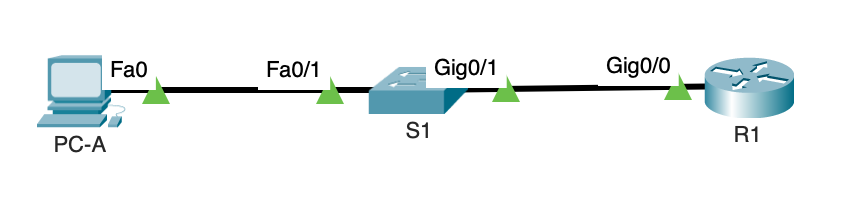
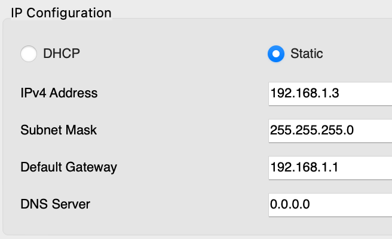

#Лабораторная работа. Доступ к сетевым устройствам по протоколу SSH

Топология


Таблица адресации

| Устройство | Интерфейс | IP-адрес     | Маска подсети | Шлюз по умолчанию |
|------------|-----------|--------------|---------------|-------------------|
| R1         | G0/0      | 192.168.1.1  | 255.255.255.0 | 192.168.1.1       |
| S1         | VLAN 1    | 192.168.1.11 | 255.255.255.0 | 192.168.1.1       |
| PC-A       | NIC       | 192.168.1.3  | 255.255.255.0 | 192.168.1.1       |

Таблица пользователей

| Имя пользователя | Пароль    |
|------------------|-----------|
| sshadmin         | Adm1nP@55 |

### Задание:

1. Настройка основных параметров устройства
2. Настройка маршрутизатора для доступа по протоколу SSH
3. Настройка коммутатора для доступа по протоколу SSH
4. SSH через интерфейс командной строки (CLI) коммутатора

### Настроить основные параметры устройств

Топология сети



Выполняем инициализацию и перезагрузку маршрутизатора и коммутатора

```
erase startup-config
reload
```

### Конфигурация основных параметров маршрутизатора и коммутатора

Конфигурация основных параметров сводиться к:
  
1. Изменение имени хоста маршрутизатора и коммутаторе на R1 и S1 соответственно.
2. Обеспечить безопасный доступ в пользовательский режим EXEC.
  - Включить шифрование паролей.
3. Обеспечить безопасный доступ в привилегированный режим EXEC.
4. Отключить поиск DNS.
5. Создать баннер, предупреждающий о запретье несанкционированного доступа.
6. Настроить и активировать на маршрутизаторе интерфейс G0/0.
7. Настроить и активировать на коммутаторе интерфейс VLAN 1.
7. Сохранить конфигурацию.

### Конфигурация сети компьютера PC-A и проверка подключение к сети

Выполним конфигурацию компьютера согласно таблицы адресации



Проверим подключение к сети

```
C:\>ping 192.168.1.1

Pinging 192.168.1.1 with 32 bytes of data:

Reply from 192.168.1.1: bytes=32 time=21ms TTL=255
Reply from 192.168.1.1: bytes=32 time<1ms TTL=255
Reply from 192.168.1.1: bytes=32 time<1ms TTL=255
Reply from 192.168.1.1: bytes=32 time<1ms TTL=255
```

### Конфигурация протокола SSH маршрутизаторе R1 и коммутаторе S1

Настроим домен

    ip domain-name otus.ru
  
Создим ключ шифрования с указанием его длины

	crypto key generate rsa general-keys modulus 2048
	
Активируем версию №2 протокола SSH

	ip ssh version 2	
	
Создадим пользователя в локальной базе учетных записей согласно таблицы пользователей

	username sshadmin privilege 15 secret Adm1nP@55
	
Активировать протоколо SSH на линиях VTY

```
line vty 0 4
 login local
 transport input ssh
```	

### Сохранить конфигурацию 

### Установить соединение с маршрутизатором по протоколу SSH

Соединение с маршрутизатором

```
C:\>ssh -l sshadmin 192.168.1.1

Password: 

 !!!!!!!!!!Attention!!!!!!!!!!!
Access denied


R1#sh run
Building configuration...

Current configuration : 1095 bytes
!
version 15.1
no service timestamps log datetime msec
no service timestamps debug datetime msec
service password-encryption
!
hostname R1
!
!
!
enable secret 5 $1$mERr$9cTjUIEqNGurQiFU.ZeCi1
...
```

### Установить соединение с коммутатором по протоколу SSH

Соединение с коммутатором

```
C:\>ssh -l sshadmin 192.168.1.11

Password: 

 !!!!!!!!!!ATTENTION!!!!!!!!!!!!!!
ACCESS DENIED

S1#sh run
Building configuration...

Current configuration : 1404 bytes
!
version 15.0
no service timestamps log datetime msec
no service timestamps debug datetime msec
service password-encryption
!
hostname S1
!
enable secret 5 $1$mERr$9cTjUIEqNGurQiFU.ZeCi1
...
```


### Установить с коммутатора S1 соединение с маршрутизатором R1 по протоколу SSH

```
S1#ssh -l sshadmin 192.168.1.1

Password: 

 !!!!!!!!!!Attention!!!!!!!!!!!
Access denied


R1#
R1#
R1#
R1#sh run
Building configuration...

Current configuration : 1095 bytes
!
version 15.1
no service timestamps log datetime msec
no service timestamps debug datetime msec
service password-encryption
!
hostname R1
!
```

Файлы конфигураций устройств приведены [здесь](configs/)

### Вопрос 

В1: Как предоставить доступ к сетевому устройству нескольким пользователям, у каждого из которых есть собственное имя пользователя?
О: Чтобы предоставить доступ к сетевому устройсту нескольким пользователям, необходимо создать локальные учетные записи для этих пользователей.